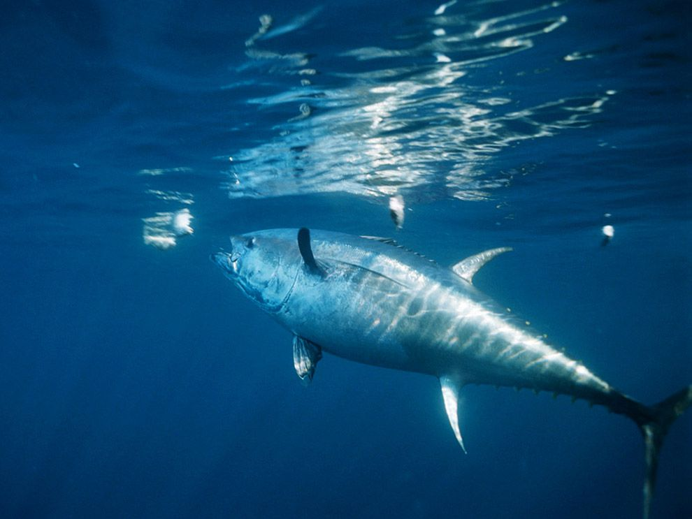

class: title-slide, top, left, inverse
background-image: url(https://pbs.twimg.com/media/D7Km39PXYAA3UGP?format=jpg&name=large)
background-size: cover

# **`r rmarkdown::metadata$title`**
## **`r rmarkdown::metadata$subtitle`**
### `r rmarkdown::metadata$author`
### **`r rmarkdown::metadata$institute`**
### `r Sys.Date()`

```{r setup, include=FALSE}
#load multiple libraries function location
source("C:/Users/Sebbi Kankondi/Desktop/Academic/PhD/Write_Ups/multiple_libraries.R")

read_library(tidyverse, leaflet, sf,
             readxl, ggmap, htmltools, knitr)

options(htmltools.dir.version = FALSE)
```

---

name: mfmr

# MFMR

Central institution, governing the sustainable utilization of Namibia's aquatic resources

---

template: mfmr

.pull-left[
- Consists of several offices, research centers and fish farms throughout the country
]
.pull-right[
```{r out.width='100%', fig.height=6, eval=require('leaflet'), echo=FALSE}
#read in world borders shape file
world_border <- read_sf(paste("C:/Users/Sebbi Kankondi/Desktop/Academic/PhD/Write_Ups",
                              "/MHA_MHU/data/mapshapes",
                              "/world_borders/TM_WORLD_BORDERS-0.3.shp", sep=""))

#read in the MFMR facilities coordinates
#convert multiple variables to numeric or factor
mfmr_coords <- read_excel("data/institute_location.xlsx") %>% 
    mutate_at(c("long","lat"), as.numeric) %>% 
    mutate_at(c("region","town","institute","institute_type"), as.character)  
  # st_as_sf(coords = c("lat","long"), crs = 4326)

#create new label variable for mfmr_coords that contains multiple
#values pasted together

##need to create them as an html tag and then mark them as html so
##that it can be rendered into the map as an html tag
mfmr_coords$label <- paste("<p>", mfmr_coords$institute, "<p/>",
                           "<p>", mfmr_coords$institute_type, "<p/>",
                           "<p>", mfmr_coords$town, "<p/>")


leaflet() %>% 
  addTiles() %>% 
  addProviderTiles(providers$Esri.WorldImagery) %>% 
  setView(18.4940, -22.9576, zoom = 5.45) %>% 
  addPolygons(data = world_border, 
              weight = 1, color="#FFFAFA",
              smoothFactor = 0.5) %>%  ##Change border color and size
  addCircleMarkers(lng = mfmr_coords$long, lat = mfmr_coords$lat,
                   color = "#FF4500", radius = 3, opacity = 1,
                   label = lapply(mfmr_coords$label, HTML)) #tag as HTML

```
]

---

template: mfmr

.pull-left[

### Windhoek HQ

- Primary administrative offices

]

.pull-right[
```{r out.width='100%', fig.height=6, eval=require('leaflet'), echo=FALSE}
leaflet() %>% 
  addTiles() %>% 
  addProviderTiles(providers$Esri.WorldImagery) %>% 
  setView(17.08414, -22.556, zoom = 13.5) %>% 
  addCircleMarkers(lng = mfmr_coords$long, lat = mfmr_coords$lat,
                   color = "#FF4500", radius = 3, opacity = 1,
                   label = lapply(mfmr_coords$label, HTML)) #tag as HTML

```
]

---

name: whk-hq

# Windhoek HQ

Including offices of the:

---

template: whk-hq

.pull-left[

- Minister
   - Hon. Derek Klazen

]

.pull-right[


]


---

template: whk-hq

.pull-left[

- Minister
   - Hon. Derek Klazen
- Deputy Minister
   - Hon. Sylvia Makgone

]

.pull-right[


]


---

template: whk-hq

.pull-left[

- Minister
   - Hon. Derek Klazen
- Deputy Minister
   - Hon. Sylvia Makgone
- Executive Director
   - Ms. Annely Haiphene

]

.pull-right[


]


---

template: mfmr

.pull-left[

### NatMIRC

- Primary research center

]
.pull-right[
```{r out.width='100%', fig.height=6, eval=require('leaflet'), echo=FALSE}
leaflet() %>% 
  addTiles() %>% 
  addProviderTiles(providers$Esri.WorldImagery) %>% 
  setView(14.52294, -22.6854, zoom = 14) %>% 
  addCircleMarkers(lng = mfmr_coords$long, lat = mfmr_coords$lat,
                   color = "#FF4500", radius = 3, opacity = 1,
                   label = lapply(mfmr_coords$label, HTML)) #tag as HTML

```
]

---

template: mfmr

.pull-left[

### NatMIRC

- Primary research center
- Some administrative functions.

]
.pull-right[
```{r out.width='100%', fig.height=6, eval=require('leaflet'), echo=FALSE}
leaflet() %>% 
  addTiles() %>% 
  addProviderTiles(providers$Esri.WorldImagery) %>% 
  setView(14.52294, -22.6854, zoom = 14) %>% 
  addCircleMarkers(lng = mfmr_coords$long, lat = mfmr_coords$lat,
                   color = "#FF4500", radius = 3, opacity = 1,
                   label = lapply(mfmr_coords$label, HTML)) #tag as HTML

```
]

---

template: mfmr

.pull-left[

### NatMIRC

- Primary research center
- Some administrative functions.
- Predominantly research biologists and technical staff

]
.pull-right[
```{r out.width='100%', fig.height=6, eval=require('leaflet'), echo=FALSE}
leaflet() %>% 
  addTiles() %>% 
  addProviderTiles(providers$Esri.WorldImagery) %>% 
  setView(14.52294, -22.6854, zoom = 14) %>% 
  addCircleMarkers(lng = mfmr_coords$long, lat = mfmr_coords$lat,
                   color = "#FF4500", radius = 3, opacity = 1,
                   label = lapply(mfmr_coords$label, HTML)) #tag as HTML

```
]

---

template: mfmr

.pull-left[

### NatMIRC

- Primary research center
- Some administrative functions.
- Predominantly research biologists and technical staff
- Split into 3 main sections


]
.pull-right[
```{r out.width='100%', fig.height=6, eval=require('leaflet'), echo=FALSE}
leaflet() %>% 
  addTiles() %>% 
  addProviderTiles(providers$Esri.WorldImagery) %>% 
  setView(14.52294, -22.6854, zoom = 14) %>% 
  addCircleMarkers(lng = mfmr_coords$long, lat = mfmr_coords$lat,
                   color = "#FF4500", radius = 3, opacity = 1,
                   label = lapply(mfmr_coords$label, HTML)) #tag as HTML

```
]

---

name: natmirc

background-image: url("images/ocean_zones.png")
background-size: cover

# NatMIRC

### 4 Main sections


--

- Their names generally define the research area/focus for each section.

--

.pull-left[

- Pelagic
   - Open ocean and coastal water column.

]

--

.pull-right[

- Demersal
   - Part of the water column directly above the Benthic layer
      - Benthic/Benthos denotes areas on top of/within the sediment layer.
      
]

--

.pull-left[

- Environment
   - Works in the tidal zone and the open ocean.
      - Tidal zone includes the Littorina, intertidal and subtidal zones.

]


--

.pull-left[

- Mariculture
   - Consists predominantly of shellfish culture (farming) within coastal waters.
   - Some seaweed culture.

]


---

name: pelagic

# Pelagic

Commercial pelagic resources.

--


.pull-left[


.caption[
Horse Mackerel (*Trachurus trachurus*)
]

]

--

.pull-right[



.caption[
Bluefin tuna (*Thunnus thynnus*)

] 

]

--

.pull-left[


.caption[
Cape fur seals (*Arctocephalus pusillus pusillus*)

]

]


---

name: demersal

# Demersal

Commercial demersal resources.

--


.pull-left[


.caption[
Cape hake (*Merluccius capensis*)
]

]

--

.pull-right[


.caption[
Orange roughy (*Hoplostethus atlanticus*)

] 

]

--

.pull-left[


.caption[
Red crab (*Chaceon quinquedens*)

]

]


---

name: environment

# Environment

Various physical, chemical and environmental oceanographic parameters.

--


.pull-left[


.caption[
Sea surface temperature
]

]

--

.pull-right[


.caption[
Orange roughy (*Hoplostethus atlanticus*)

] 

]

--

.pull-left[


.caption[
Red crab (*Chaceon quinquedens*)

]

]


---

